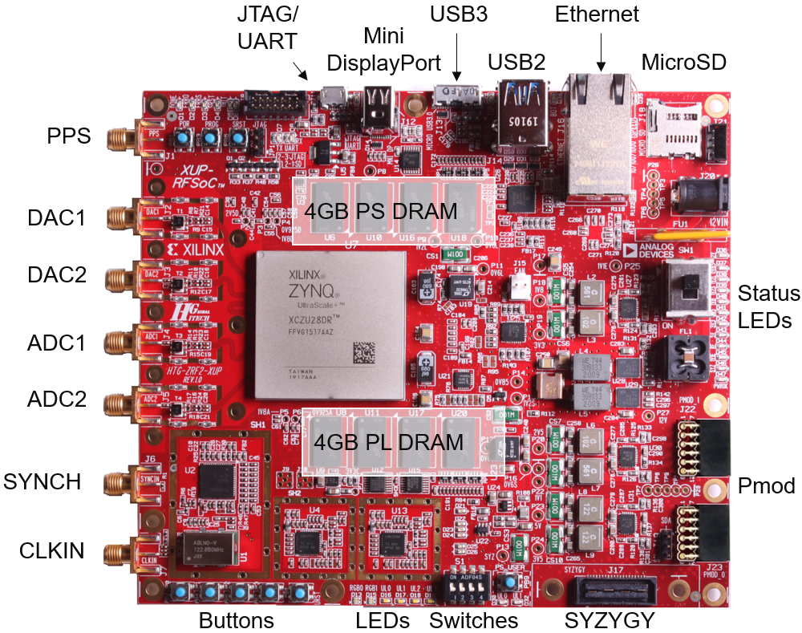

# RFSoC2x2 PYNQ Overview

## 1. Platform Basics
The RFSoC 2x2 Platform is built on the Zynq Ultrascale+ Architecture, and contains an ARM A53 processing system and an programmable logic (PL) Xilinx Ultrascale+ FPGA.

The ARM processor is used for user interaction and controlling the PL, and the PL can be used to implement specialized hardware.

When you turn the platform on, the ARM processor will boot off the  PYNQ image flashed onto the SD Card. It will boot into a Linux environment, and automatically start a Jupyter server as well as a file sharing server

This server can be accessed via the USB connection:
- Jupyter Server (website): http://pynq:9090/lab
- File Server (file explorer): \\pynq

The File Server allows you limited access to the folder structure inside the image.

For the purposes of this project **PYNQ version 2.7** was used. This version was chosen as the StrathSDR Spectrum Analyser was implemented for this image at time of writing.


[RFSoC 2x2 Specification Page](http://www.rfsoc-pynq.io/rfsoc_2x2_overview)



## 2. PYNQ and Overlays

The PYNQ environment consists of a Linux OS as well as drivers for interacting with the PL. For the purposes of this project **PYNQ version 2.7 for the RFSoC2x2** was used.

After booting into the image and connecting to the Jupyter Server, the FPGA can be programmed with bitstreams by the "Overlay".

The PYNQ platform has a bunch of libraries and drivers that handle what they refer to as "Overlays". This Overlay is an all encompassing term to describe a set of drivers and the bitstream for a hardware project.

These overlays are typically packaged as python libraries, and using such an overlay should be as simple as importing and initializing the library.

```
# Import the installed python library rfsoc_sam_custom
# Find the overlay python file, and then find the Overlay class.
from rfsoc_sam_custom.overlay import Overlay

# Initialize the overlay
# This will flash the bitstream onto the PL
overlay = Overlay(init_rf_clks = True)
```
From there I can access all the hardware implemented via the python drivers for the hardware also included in the package

```
overlay.radio.receiver?
```

## 3. Making Python pACKAGES
If i wanted to create a whole new hardware implementation into the PL. I would need:

1. The .bit file - the bitstream for the implemented hardware.
2. The .hwh file - the hardware description file that tells the PYNQ environment what type of hardware blocks have been implemented and what drivers they should use
3. The python/c driver files for interacting with the hardware.
4. The overlay python file for initializing and exposing all drivers.

I would then package all of these into a python library and install it into the PYNQ python environment.

I've automated the packaging of this process.

The [make_pkg.sh](../digital-back-end/make_pkg.sh) script when run on RFSoC2x2 board will run [setup.py](../digital-back-end/setup.py) and generate a .whl file under [dist](../digital-back-end/dist).

The reason the script has to be run on the RFSoC2x2 board is because it tries to find certain paths on the board image. There are ways to circumvent this. In [setup.py](../digital-back-end/setup.py) make the following changes:
```
Line 12: replace os.environ['Board'] with 'RFSoC2X2'
Line 15-16: Comment out
Line 21-31: Comment out
Line 71-72: Comment out
Line 76: Comment out
```
Doing this would mean that after the package installation, one would have to manually copy the Jupyter Notebooks under [digital back-end/boards/RFSoC2x2/rfsoc_sam_custom/notebooks](../digital-back-end/boards/RFSoC2x2/rfsoc_sam_custom/notebooks) onto the FPGA.

[setup.py](../digital-back-end/setup.py) does a whole bunch of things mostly just validating paths and copying stuff into a build directory. It will effectivly merge the contents of [digital back-end/boards/RFSoC2x2/rfsoc_sam_custom](../digital-back-end/boards/RFSoC2x2/rfsoc_sam_custom) and [digital back-end/rfsoc_sam_custom](../digital-back-end/boards/RFSoC2x2/rfsoc_sam_custom).