# 1. Tool/Software Stack

Here are the tools and versions that were used for this project

It is recommended that the same versions are used, especially for Vivado.
Matlab/simulink plugins may be more forgiving.

| Tool/Software                                             | Version |
| --------------------------------------------------------- | ------- |
| PYNQ                                                      | 2.7     |
| Vivado                                                    | 2020.2  |
| MATLAB                                                    | R2020a  |
| Simulink                                                  | 10.1    |
| Simulink Plugin - HDL Coder                               | 3.16    |
| Simulink Plugin - MATLAB Coder                            | 5.0     |
| Simulink Plugin - Fixed-Point Designer                    | 7.0     |
| Simulink Plugin - DSP System Toolbox                      | 9.10    |
| Simulink Plugin - SoC Blockset                            | 1.2     |
| Simulink Plugin - SoC Blockset Support for Xilinx Devices | 20.1.7  |

# 2. Recreating the Vivado Project
Before we make custom blocks, let's start from the basics of looking at the existing implementation.

Familiarity with Vivado would be an advantage in this section.

Under [digital-back-end/boards/RFSoC2x2/rfsoc_sam_custom](../digital-back-end/boards/RFSoC2x2/rfsoc_sam_custom/) there are three tcl files:
1. rfsoc_sam_custom.tcl: tcl script with information on block diagram
2. make_block_design.tcl: tcl script to create a project with the block design specified in rfsoc_sam_custom.tcl
3. make_bitstream.tcl: tcl script to generate bitstream

For this project, **Vivado Version 2020.2** was used. It is highly recommended that this same version is used. Vivado changes a quite a bit between versions, and various properties may break if a different version is used. It is certainly untested with other versions.

1. Open Vivado 2020.2

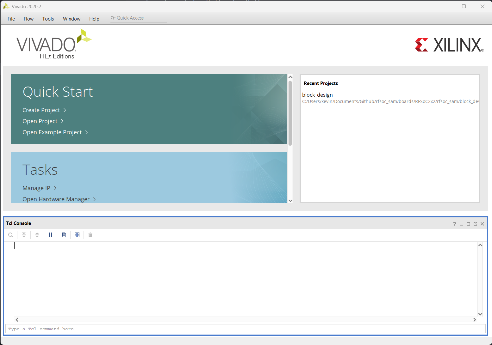

2. In the TCL Console at the bottom `cd` into [digital-back-end/boards/RFSoC2x2/rfsoc_sam_custom](../digital-back-end/boards/RFSoC2x2/rfsoc_sam_custom)

3. Run `source make_block_design.tcl`
4. Wait for project to be created
5. Make sure there are no errors in the tcl console originating from the script running.

The following block design should now be created

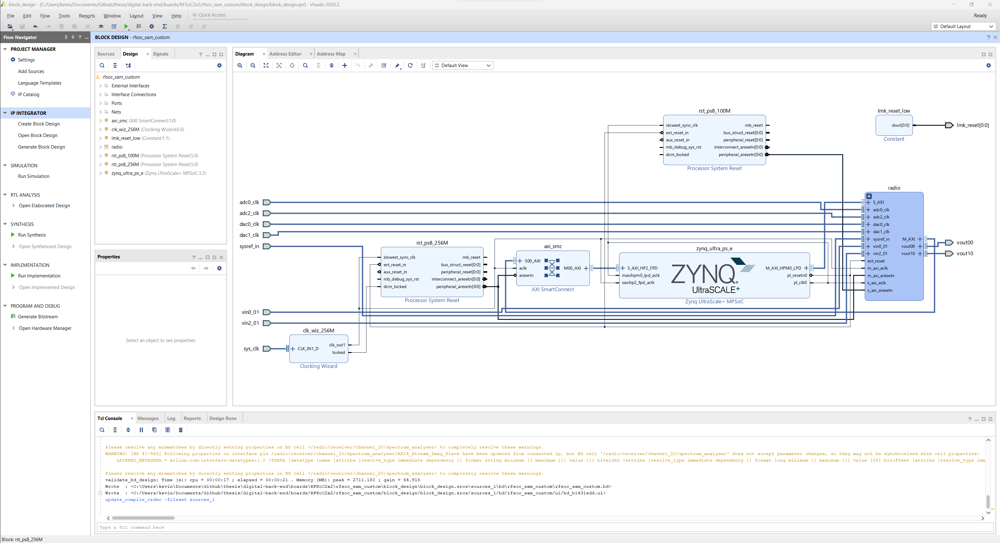

For the spectrum analyser, we are interested in the radio block on this diagram. Double click the radio block.

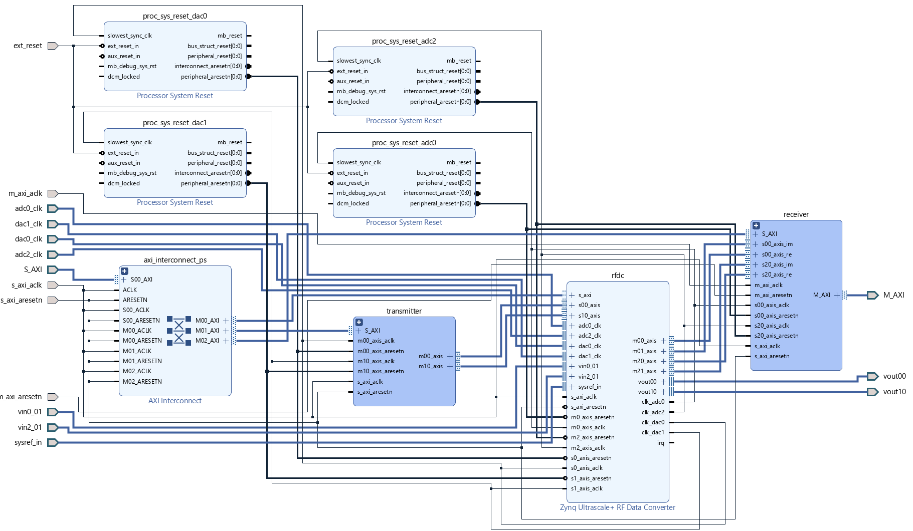

Here there are three blocks of interest
1. transmitter
2. [Zynq Ultrascale+ RF Data Converter](https://docs.xilinx.com/r/en-US/pg269-rf-data-converter)
3. reciever

The [RF Data Converter](https://docs.xilinx.com/r/en-US/pg269-rf-data-converter) is a specialized block provided by Xilinx. It handles configuring the ADCs and aquiring the data. It then sends the data to the FPGA logic fabric via AXI interfaces. I won't go into how AXI works, but its basically a bus data transfer protocol. See the link above for specifications on the RF Data Converter. There's a lot of features, but for this project, the most important are its mixer capabilities, and up to a factor of 8 decimations.

You can double click all these blocks to configure them. We'll focus on the reciever for now.

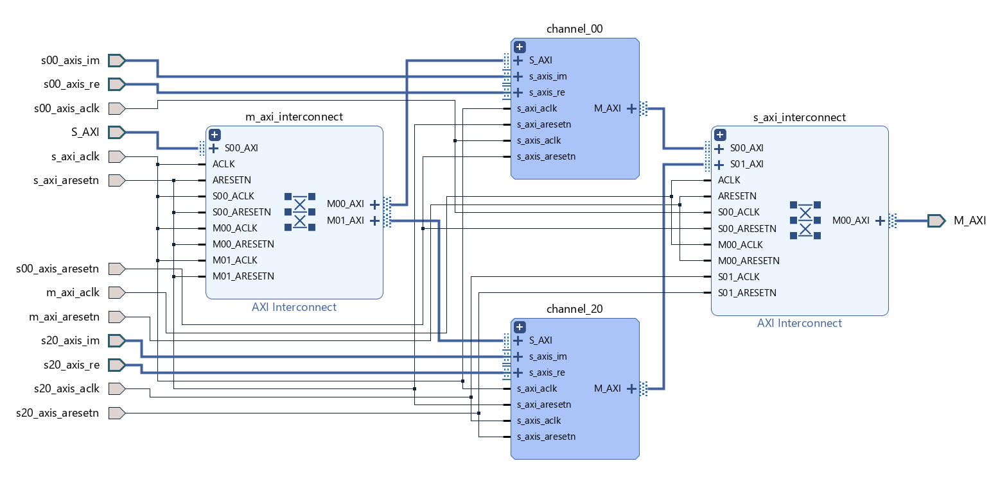

Here we see a bunch of AXI interconnects. We also see a couple of channels.

Each of these channels represent the FPGA implemented logic to process the ADC data. There are of course 2 channels for the 2 ADCs on the board. Double click on one of the channels, they are identical.

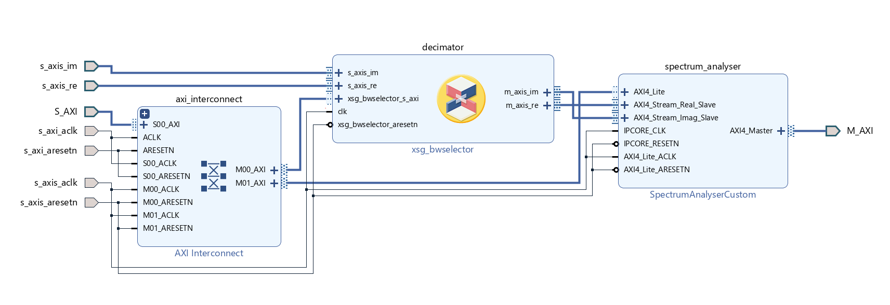

We will see a decimator block (Bandwidth Selector) and a Spectrum Analyzer block. We can't go inside these blocks and configure them in Vivado. These are packaged IPs written in VHDL. These IPs are located [digital-back-end/boards/ip/iprepo](../digital-back-end/boards/ip/iprepo)

See section 3 for details on how to modify the blocks.

For this project, when I modified the blocks and generated the new IPs, i moved the IPs into the iprepo folder, replaced the IPs in this diagram with the new version.

This could be done manually, or i could make modifications to the rfsoc_sam_custom.tcl file and just remake the project. This was my preferred method, as it ensured that even if I lose the project file somehow, I could recreate the exact project with the block I wanted.

I made a script [digital-back-end/scripts/customise_packages.py](../digital-back-end/scripts/customise_packages.py) that makes the tcl changes for me. This script also makes some changes in the driver files which we shall discuss in section 4.

# 3. Configuring Custom IPs

For this section all folders exist in [digital-back-end/boards/ip](../digital-back-end/boards/ip)

The [hdlcoder_custom](../digital-back-end/boards/ip/hdlcoder_custom/) folder contains the Simulink/Sysgen files for the Spectrum Analyzer block as seen section 2.

We however can't just click on these simulink files. We must launch them through the System Generator which comes with Vivado 2020.2

## 3a. Configuring System Generator
After Vivado is installed, the system generator should also have been installed.

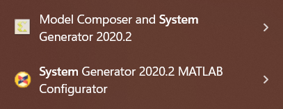

First start the System Generator MATLAB Configurator with permissions.

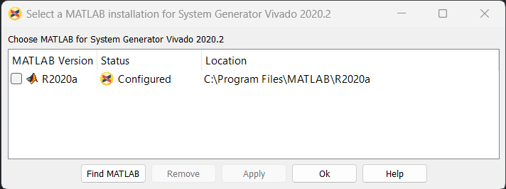

Click on the R2020a, and hit apply. Ensure the status is set to configured after.

Then use the "Model Composer and System Generator 2020.2" app to launch the system configurator.

This will actually just launch MATLAB, but i believe what its doing is finding and setting environment variables required for the system generator.

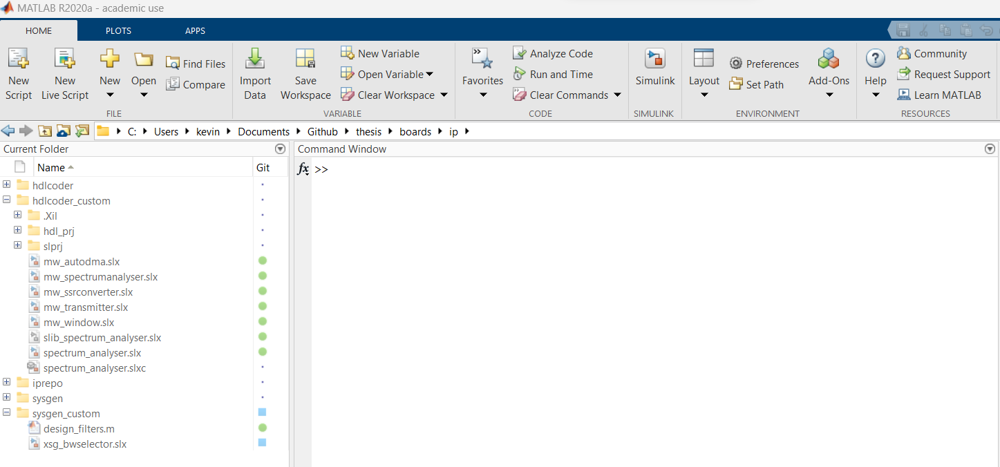

## 3b. Modifying the Spectrum Analyser

Navigate to [hdlcoder_custom](../digital-back-end/boards/ip/hdlcoder_custom/) in System Generatored MATLAB.

We will open two files:
1. slib_spectrum_analyser.slx
2. spectrum_analyser.slx

the slib file is the library for the spectrum analyser and contains the blocks for the analyser. You need to unlock the slib library. Press the lock icon under the library ribbon.

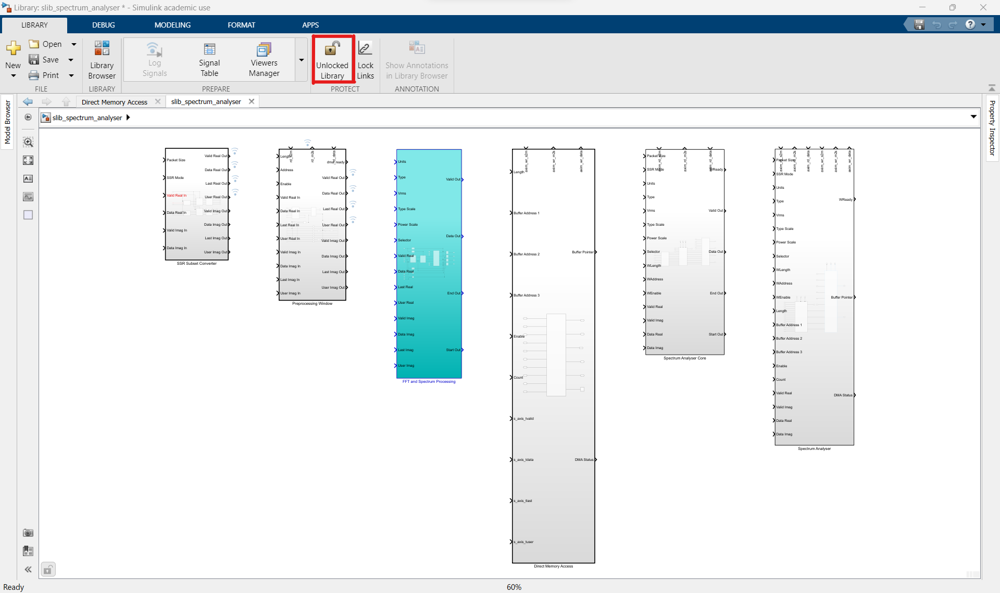

To increase the FFT Length I made changes to the following blocks.

1. In the FFT and Spectrum Processing Block
    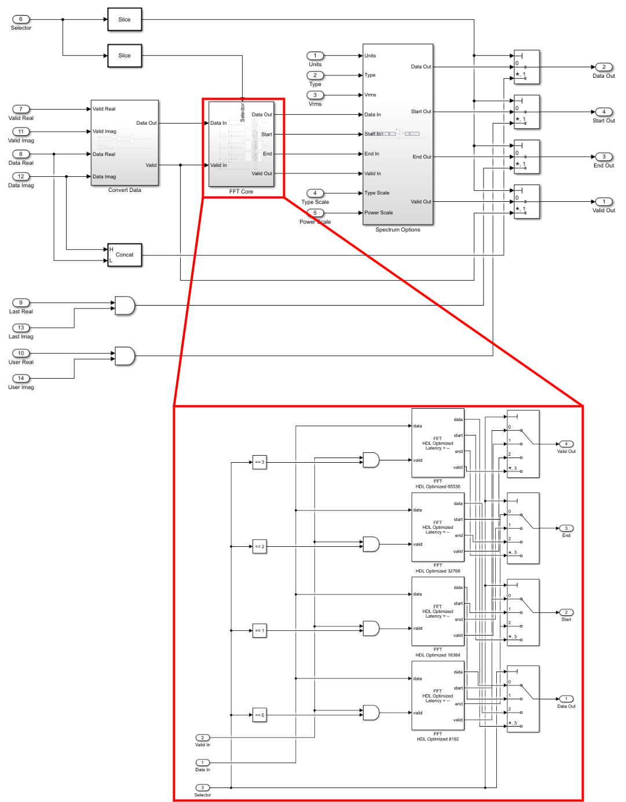
    - The FFT Core block was modified to include up to 2^16 FFT Lengths.
    2^16 was the limit of the modification for the block used.

2. In Direct Memory Access > Direct Memory Acess > DDR Communication Block
    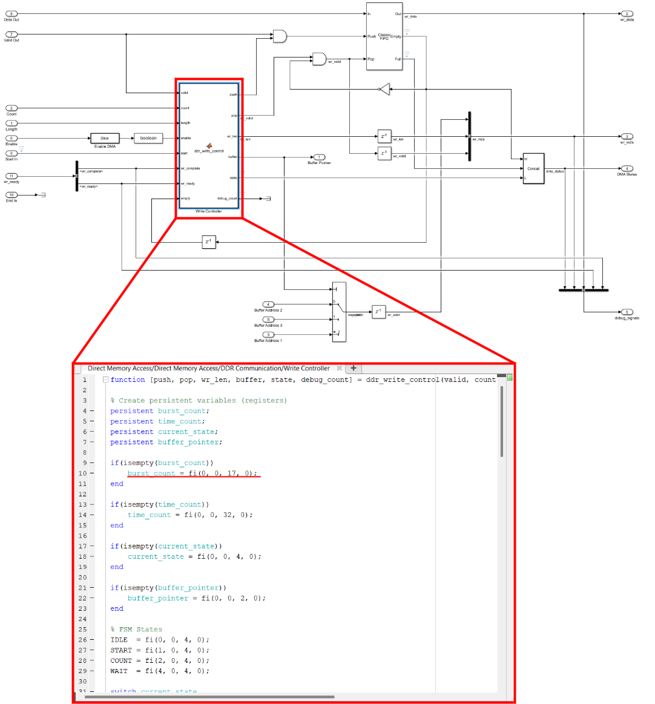

    - The Write Controller's MATLAB logic had to be modified for certain variables to use more bits.
    - 2^16 12-bit samples requires 2^17 bytes. So Write controllers need to be able to count to that number.

3. In Direct Memory Access > Direct Memory Acess > DDR Communication Block
    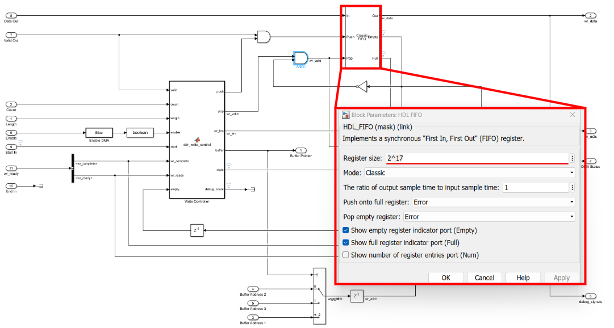

    - For the same reason as 2. Increased FIFO to 2^17

4. In Preprocessing Window
    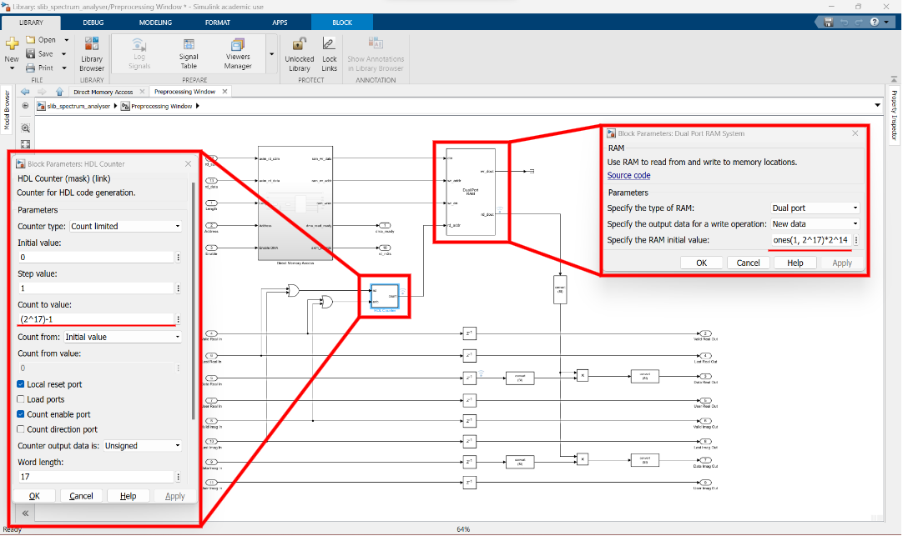

    - Dual Port RAM increased to 2^17
    - Counter increased to 2^17

## 3c. Validating and Packaging the IP

After modifications were made in slib, open spectrum_analyser.slx and ensure the changes to the libraries are reflected.

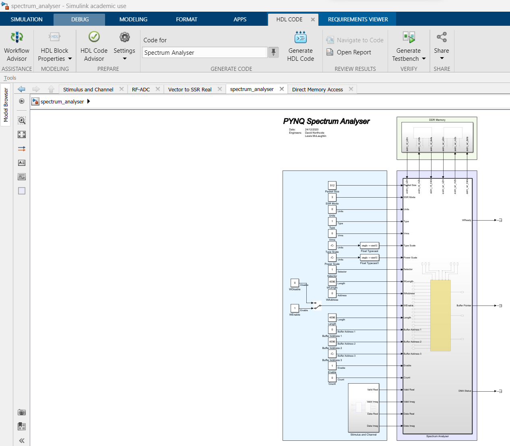

In the ribbon. Click on the `HDL Advisor`.
This can be used to verify effectively the synthesis of the design. It will check for things such as bit widths etc.

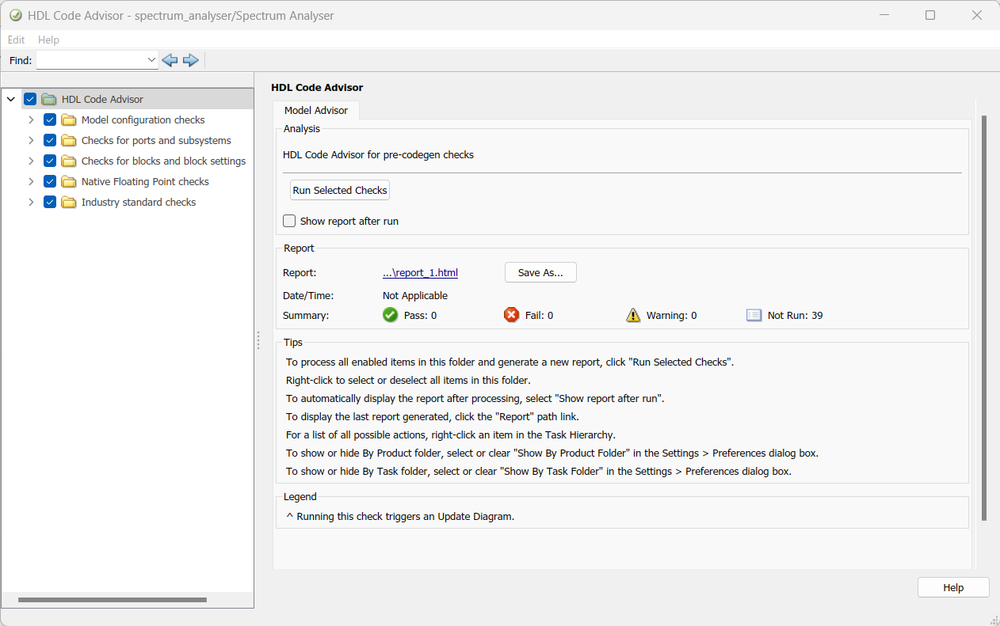

Close the window after all checks are done.

Click on the similar button `Workflow Advisor` in the ribbon.
This is the window used to generate and package the actual IP.

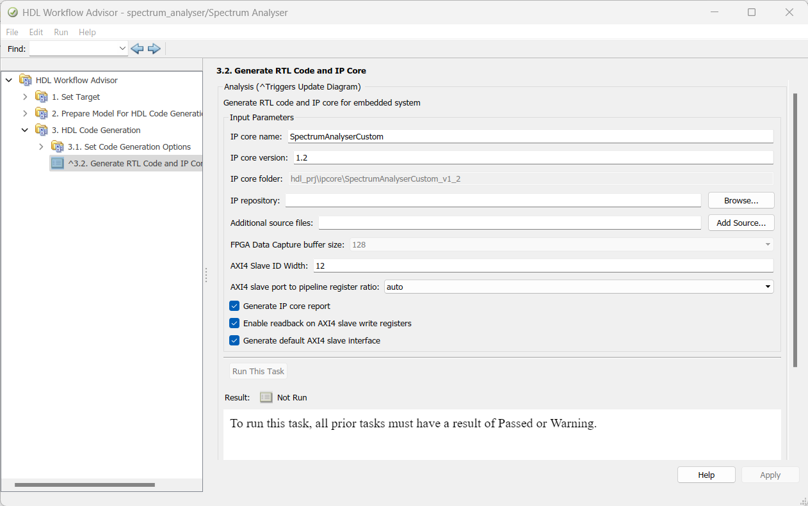

In section 3.2 of this advisor, the IP name and version can be set. After applying the changes (if you have changed the name and version) you can generate the new IP by right clicking on the HDL Workflow Advisor section on the left window.

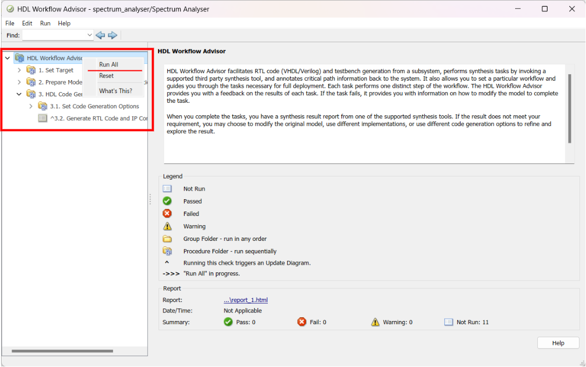

When the IP generation is complete all checks should have passed

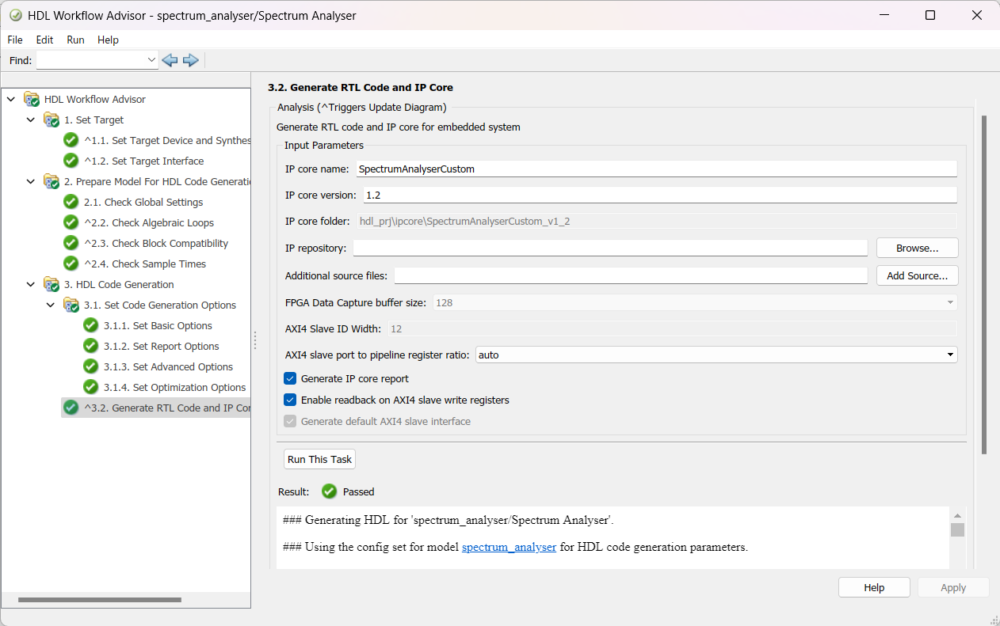

The newly generated IP should be under a folder named

hdl_prj\ipcore - You can also look at section 3.2 of the workflow advisor for the ip core folder.

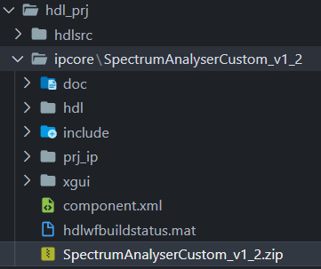

Copy this generated IP into [iprepo](../digital-back-end/boards/ip/iprepo/)

# 4. Modifying Drivers and Block Diagram

The changes that you will have to make to the drivers and block diagram would be highly dependent on what change you have made. If it was simply modifying the FFT Length of the Spectrum analyser I made a simple script to automatically make the changes [digital-back-end/scripts/customise_packages.py](../digital-back-end/scripts/customise_packages.py).

This script goes through the various .tcl scripts .py files under the folders:
1. [digital-back-end/rfsoc_sam](../digital-back-end/rfsoc_sam)
2. [digital-back-end/boards/RFSoC2x2/rfsoc_sam](../digital-back-end/boards/RFSoC2x2/rfsoc_sam)

The script contains a dictionary which should be modified if ip repo versions or FFT Sizes are changed.

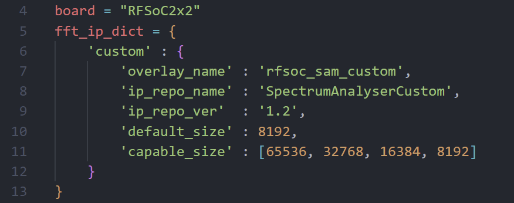

After the script runs, the newly made .tcl files should be re-run to recreate the block diagram with the new custom blocks.

With respect to the driver changes, again it is highly dependent on what blocks you are changing.

You may be able to modify or use existing drivers, or you may have to create your own drivers from scratch.

For more details the offcial [PYNQ tutorials](https://pynq.readthedocs.io/en/v2.0/overlay_design_methodology/overlay_tutorial.html) are available.

# 5. Geneating Bitstream, Creating and installing Python Package.

After the block diagram is ready, close the block diagram and the project associated with it until you are at the main menu again.

Make sure vivado has access to licences if you are using remote licenses for this stage.

From here run the other make_bitstream.tcl file mentioned previously.
This should start to generate the .bit and .hwh files for the block diagram.

After everything is generated, run the [make_pkg.sh](digital-back-end/make_pkg.sh) as discussed in [RFSoC2x2_PYNQ_overview](RFSoC2x2_PYNQ_overview.md) to package the python library.

You can then install the python library with `python3 -m pip install <package_name>.whl`